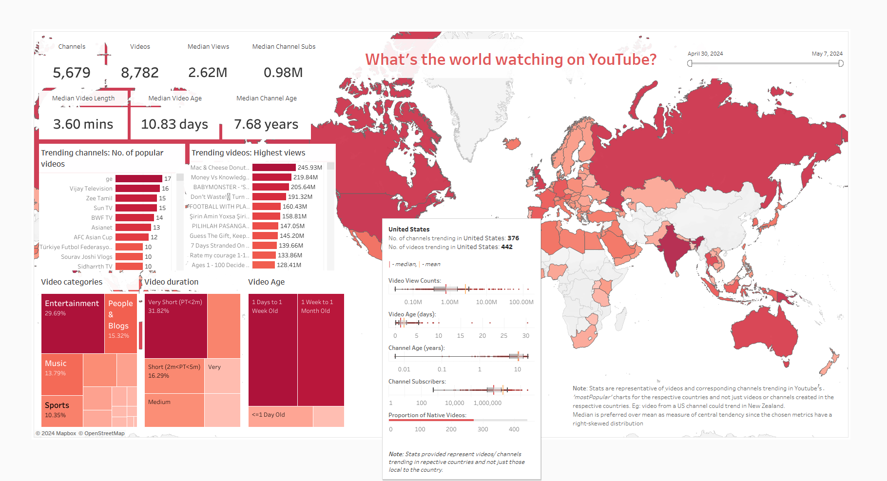

# youtubeanalytics
 As someone who had ample free time at hand and spent an embarassing amount of that navigating youtube rabbit holes watching tons of videos, a data analytics project focused on the same seemed like a perfect way to redeem some of that shame :sweat_smile:. So here goes!

## What do we have here?
Through this project, I have used the [YouTube Data API](https://developers.google.com/youtube/v3) to pull data from youtube on the most popular youtube videos in respective countries daily, and visualize it on Tableau.

## Tools used:
- Programming: [Python 3.7.13](https://www.python.org/downloads/release/python-3713/), [Pandas](https://pandas.pydata.org/), [Youtube API Python client Library](https://github.com/googleapis/google-api-python-client)
- IDE: [VS Code](https://code.visualstudio.com/)
- Orchestration:[Apache Airflow](https://airflow.apache.org/) running on [Docker containers](https://www.docker.com/)
- Database: [PostgreSQL](https://www.postgresql.org/)
- Database client: [DBeaver](https://dbeaver.io/)
- Viz: [Tableau Desktop](https://www.tableau.com/support/releases/desktop/2024.1.2)

## Basic Outline

Below image depicts the basic process flow:

 

**1. Extract**: Requests were made to the Youtube Data API using the python client library to:
   - Fetch details of the 'mostPopular' videos for the respective country using the [videos.list()](https://googleapis.github.io/google-api-python-client/docs/dyn/youtube_v3.videos.html#list) method of the youtube API client.
   - Fetch channel details of videos using [channel.list()](https://googleapis.github.io/google-api-python-client/docs/dyn/youtube_v3.channels.html#list) method.
   - Fetch video category details using the [videocategories.list()](https://googleapis.github.io/google-api-python-client/docs/dyn/youtube_v3.videoCategories.html#list) method.

**2. Transform**: Used pandas to flatten and transform the json files received as the API responses for respective requests into dataframes mirroring the format of the tables the data needs to be stored as in a PostgreSQL database.

**3. Load**: Loaded the final transformed data to SQL tables in a PostgreSQL Database hosted on my personal laptop.

The above ETL pipeline is run daily by wrapping the necessary python functions into tasks of an [Airflow dag](/youtube_vids.py) and scheduled to run daily.

**4. Visualize** the Data on Tableau [Published Viz on Tableau Public](https://public.tableau.com/app/profile/richard.t.vetticad/viz/PopularYouTubeVideos/WhatstheworldwatchingonYouTube?publish=yes)

## Some high-level insights:
- Over the course of the entire week spanning 30th April to 7th of May 2024, countries **India**, **USA**, **Canada**, **UK**, **Australia** and interestingly **Papua New Guinea** make the list of top contentors having the cumulative highest number of trending videos for the week. However, looking at each of the days individually, there are several more countries like most of the **Latin American** and **South American** countries that consistently accompany the weekly top countries in terms of most trending daily videos along with other notables (not an exhaustive list) like **France**, **Germany**, **Iceland**, **Estonia** in Europe, **Morocco**, **Algeria** ,**Libya**, **Egypt** in Africa, **Saudi Arabia**, **Iraq** among Arabian countries and **Indonesia**, **South Korea**, **Japan** from Australasia. Almost all of them touch the upper cap of 200 trending videos daily. Notably **India** and **Russia** don't feature in the daily list and possibly this could be attributed to a high churn rate of videos on a daily basis which needs to be ascretained.
- A total of **5679 videos** and **8782 videos** analyzed.
- Chosen key metrics for analysis had a **right-skewed distribution**, for example relatively higher numbers of short videos trending as compared to longer videos (no surprises there). Hence, **median** was chosed as the preferred measure of central tendencey over mean for the KPI cards.
- Key high-level global metrics:
   - Median views on videos: **2.6 Million**
   - Median channel subscribers: **0.98 Million**
   - Median video length: **3.60 mins**
   - Median video age: **10.83 days**
   - Median channel age: **7.68 years**
- Most popular categories of videos: **Entertainment**, followed by **People & blogs**, **Music** and **Sports** in order of popularity.
